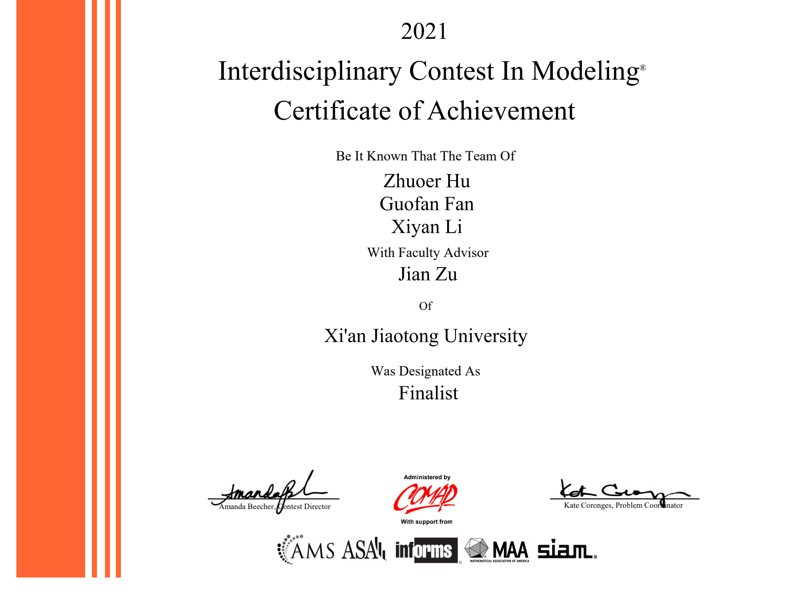

# ICM2021 Finalist Team 2105298 source code

**谨以此项目小小纪念一下打了三年的数模生涯** 

> 打数模从大一一直打到大三，终于在最后一次打了个像样的成绩出来。想留点东西纪念一下三年的数模，和队友商量了一下决定把这次美赛的源码开源一下，于是有了这个仓库。

本仓库提供了 ICM2021 D Problem Finalist Team 2105298 的论文和源代码等文件供大家学习交流。

目前我这里的源码只有大部分模型和作图部分，`ARIMA` 、 `分析模型` 和 `部分数据处理` 等是由我的队友完成，我也会邀请他们来完善这个仓库~

由于经过的时间太长且三天的时间很紧，我们只能尽力复原所有代码和操作，某些代码/操作并没有做记录，这里说声抱歉。

如果你有疑问的话，欢迎提issue或给我发邮件[fanguofan@asteriscum.cn](mailto:fanguofan@asteriscum.cn)。

> issue 请到 Github 仓库提或者直接发邮件给我

文末也会有数模的一些小小经验和相关资源的推荐。

## Paper and Result

#### Our paper

> 由于三天时间真的很有限（最后一分钟都还在改），我们后面发现论文中有不少小错误。后面有时间（老鸽子了）会更新更正版本。

[Paper 全文](./figure/2105298.pdf)

关于论文排版请看[排版部分](#排版)

## Code

[Source code](./code/code.ipynb)

网页查看( Gitee Pages 被封了只能用 Github Pages 稍微有点慢等一等): [Source code Web](https://chaoers.github.io/icm2021-2105298-finalist/)

### About Data

- 在`data`文件夹下,`source_data`为 ICM 官方数据

- 在建模过程中很多数据是队友处理好直接给我的，对于其中能够还原为原始数据的我已经处理过了，其中我们自己引入的数据都放在`our_data`文件下，并在下表中标注了数据处理过程。在源代码中搜索`result data`注释也可以在引入出看到数据解释。

|   Our Data   |   Definition   |
| ---- | ---- |
|   6data.csv   |   6类主流流派数值平均值   |
|   n_ar.csv   |   n 年代的艺术家id   |
|   相关系数.txt   |   12类数据的相关系数矩阵   |
|   sublist   |   示例节点在矩阵中位置   |

## Figure

- 本文大部分图片使用 [matplotlib](https://matplotlib.org/stable/index.html) 绘制，并全局使用 [seaborn](https://seaborn.pydata.org) 进行全局美化

> 之前建模一直用 `MATLAB` 来着，这次因为 `MATLAB` 没法画网络图就转 `Python` 了，没想到最后真的就全用 `Python` 做完了。现在回来看只能说：
> 
> **Python 真香！**

- 少部分复杂图使用 [Echarts](http://echarts.apache.org/zh/index.html) 完成

> 有前端基础的同学推荐使用，美化度极高。
> 
> 我是因为本职工作就是前端工程师（目前在字节跳动 @bytedance 实习）之前就使用过前端数据可视化的库才用的。
> 
> **没有前端基础的同学别学啊**，前端涉及面及广，出了问题 debug 会耗费大量时间，老老实实用 [matplotlib](https://matplotlib.org/stable/index.html) 也可以画出很好看的图

- 有部分图想要特殊标注，我的做法一般是用 `PS` 进行坐标轴或者特殊数据的标注，会比在画图包中标注的快
- 最后的产品图使用 [墨刀](https://modao.cc) 设计的

## Resources

这里推荐一下我觉得在数模中有用的东西

> 持续更新中...不妨点个Star收藏一下
> 
> 如果你还有其他需要，欢迎提issue或给我发邮件[fanguofan@asteriscum.cn](mailto:fanguofan@asteriscum.cn)，我会尽量更新
> 
> issue 请到 Github 仓库提或者直接发邮件给我

### Books

> 没收钱（JD快点打钱！），哪里便宜哪里买，或者找找退役的学长要

- [数学建模算法与应用及习题解答](https://u.jd.com/QE9MFhb) 司守奎，孙兆亮 编

作为编程位肯定是最重要没有之一的书（据队友反应建模位这本书也是top1），啃通了基本数模就通关了

- [数学模型](https://u.jd.com/QUXFqXd) 姜启源 编

经典老书了，对建模位比较有用（吧？）反正我翻了两页就没翻过了。

### 编程

- MATLAB + Lingo

这个方案可能偏向于传统的数学建模形式（比如国赛），其中 MATLAB 必会，Lingo 为 可选项，在解一些非线性方程时会很好用，还可以自动进行稳定性分析啥的。

- Python

这个方案偏向于现代的数学建模形式（比如美赛），特征为归根结底是进行数据挖掘分析相关工作，比较适用于现在的科研大环境。个人比较推荐，而且 Python 也是现在最火的语言，用好了肯定对以后各方面都用帮助。

### 排版

我三年都是使用 `Latex` 进行排版的, 所以下面所列都为`Latex`相关资源

> 真的极度推荐学一学 `Latex` ，`Latex` + `Markdown` 打爆 `Word`

- 美赛论文模板 [latexstudio-org/mcmthesis](https://github.com/latexstudio-org/mcmthesis)

- 国赛论文模板 [latexstudio/CUMCMThesis](https://github.com/latexstudio/CUMCMThesis)

这两个模板每年都会根据要求更新，直接用最新的就行了不用管每年的格式要求

### 作图

> 俗话说：美赛就是美术大赛（误），所以作图是很重要的

#### 自带的作图库

- MATLAB:

MATLAB 做的图必须修一修才能用，这里推荐我国赛用的插件 [ztinpn/utilForFormat](https://github.com/ztinpn/utilForFormat)

- Python:

[matplotlib](https://matplotlib.org/stable/index.html)做出的图本身就很好看了，想再美化下风格的话就用 [seaborn](https://seaborn.pydata.org) 吧

#### 第三方作图

其实用好自带的完全够了，下面的只是个人比较熟悉的用起来会快一点，没有学过的同学不必强求

- 前端可视化图表库
  - [Echarts](http://echarts.apache.org/zh/index.html) 我自己主要用的库，优点是社区丰富，大部分需要的形状直接有轮子
  - [G2Plot](https://g2plot.antv.vision/zh) or [G2](https://g2.antv.vision/zh) 填补了 Echarts 的一些空白，但是文档写的不是很好，而且没有社区。
> 还是那句话，有前端基础的同学推荐用，没有的建议不要学，反而耽误了时间最后效果不一定好

- 产品图
  - [墨刀](https://modao.cc) 优点是会自动生成有手机外壳的模板
  - [蓝湖](https://lanhuapp.com) 以下几个我自己感觉都差不多，随意即可
  - [Adobe Xd](https://www.adobe.com/products/xd.html)
  - [Axure PR](https://www.axure.com)
  - [Sketch](https://www.sketch.com)

- Adobe PS

有部分图想要特殊标注，我的做法一般是用 `PS` 进行坐标轴或者特殊数据的标注，会比在画图包中标注的快（别拿来造假啊喂）

- Adobe Ai

画示意图挺好用的，和 `PS` 基本可以相互替换

- IPad

其实用 IPad 进行标注或者画图用的熟可能比上面的还快。

有太太画个插图啥的不是妥妥的O奖（笑）。

**要是有太太画了请务必踢我！！**

推荐软件是: `Procreate` 

> IPad 扛把子软件， 没啥好说的

## One more thing

祝愿大家都有好成绩！

就算最后没有取得称心的成绩（我最后一次才拿了奖，真的很能理解那种感受），但至少能在大学的记忆里留点一点深刻的印象。可能这个奖目前觉得很重要，等10年20年后来看可能真的无关紧要，所以只要自己觉得尽力了就好了！

> 把酒祝东风
>
> 且共从容

## Mirror

- 本项目原始仓库为: [Github](https://github.com/chaoers/icm2021-2105298-finalist)
- 国内镜像仓库为: [Gitee](https://gitee.com/chaoers/icm2021-2105298-finalist)

> issue 请到 Github 仓库提或者直接发邮件给我
## Contributers

### Xiyan Li

> 西安交通大学 金禾经济研究中心 本科在读

- Mail: [qq2542725243@stu.xjtu.edu.cn](mailto:qq2542725243@stu.xjtu.edu.cn)

### Zhuoer Hu

> 西安交通大学 信息与计算数学 本科在读
### Guofan Fan

> 西安交通大学 生物技术(生物信息学方向) 本科在读

- Mail: [fanguofan@asteriscum.cn](mailto:fanguofan@asteriscum.cn)
- Github: [chaoers](https://github.com/chaoers)
- 个人博客: [饭饭的快乐屋](https://www.asteriscum.cn)

# License 开源协议

本项目遵循[GPL3.0](LICENSE)开源协议，请在遵循协议下使用。
